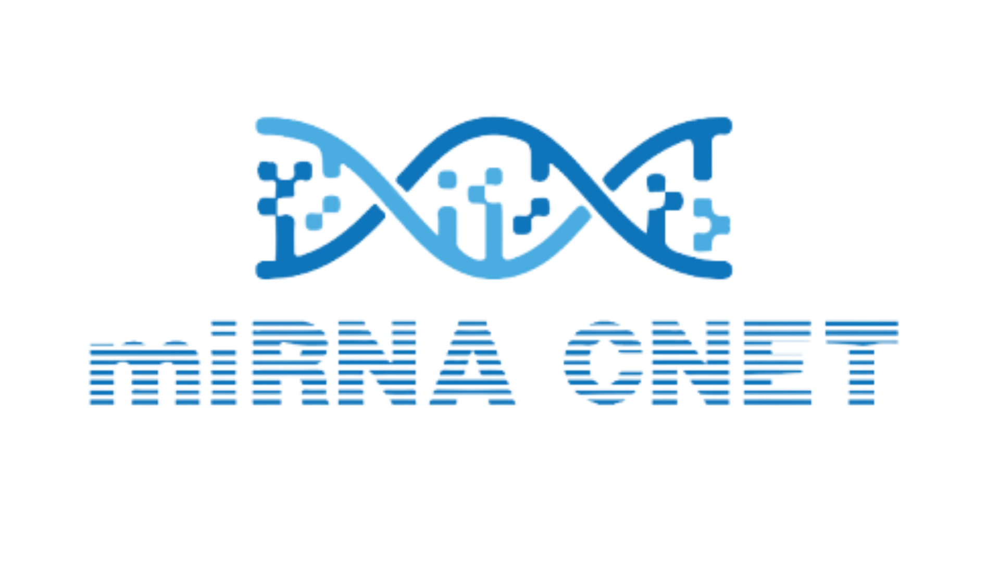

<div style="display:flex; flex-direction:row; align-items:center; justify-content:center;">

<div >

# miRNAnet Cancer Detection
</div>

<div></div>

</div>
<div>

### Project Summary 
---
The miRNACNet system is a cancer detection system based on miRNA expression profiles. The 
project aims to use SVM, KNN, and random forest models along with data 
augmentation, model explainability, and a user interface to implement the cancer detection system. 
Additionally, this project will demonstrate the necessary steps involved in taking a healthcare AI 
system from the research stage to one that is useful to physicians through a web-based application. 

### Problem Description 
---
MicroRNAs, or miRNAs, are a type of non-coding RNA. miRNAs play an important role in regulating gene expression and may play important roles in suppressing or inducing the 
development of cancerous cells [1]. Recent evidence has shown that normal miRNA expression is 
dysregulated in cancerous cells through mechanisms such as amplification or deletion of miRNA 
genes and abnormal transcriptional control of miRNAs [2]. In turn, this may affect the miRNA 
expression profiles of cancerous cells, making the use of miRNA expression for cancer detection 
feasible. miRNAs are a relatively new scientific discovery and a popular ongoing field of research with increasingly available datasets. In order to advance cancer screening methods and explore new cancer detection systems, we tackle the problem of creating a machine learning based cancer detection application using miRNA expression data. 
 
### Significance of the Problem 
---
Cancer can develop under many circumstances and affect many different tissues. As it develops, 
cancer often goes undetected until it reaches more advanced stages that makes treatment more 
expensive, invasive, and less successful [3]. Although numerous cancer screening systems exist, 
many are time consuming and complex, deterring patients from participating in preventative 
screenings [4]. Additionally, quick and efficient cancer detection systems are important for 
advancing research efforts when studying possible cancer treatments and therapies. By using the 
miRNA expression profiles of cancer cells, we will be able to develop a cancer detection system 
that differentiates between cancerous and non-cancerous cells of different tissues. This system will benefit researchers by providing for an efficient way to classify cancerous cells from miRNA profiles and may eventually benefit physicians and patients if it warrants further development as a screening method. Currently, there are no existing applications that allow users to upload miRNA data to classify the expression data as of cancerous or non-cancerous origin. This application is not intended for direct use as a screening method, but rather as a potential research tool that demonstrates a transition to a healthcare AI system from existing machine learning research.

### Goals and objectives 
---
The project’s goals are threefold: to create a machine learning model capable of modeling the 
patterns expressed in miRNA expression datasets, to create a web-based system that is capable of classifying miRNA expression profiles into cancerous and non-cancerous classes, and to publish any findings during our efforts through a research paper. These goals demonstrate the necessary steps that are involved in taking a healthcare AI system from the research stage to a stage that is useful to physicians.

## Application Specifics
## dependencies
---
The applications used are as follows:

| Application | Use |
|:------------|----:|
|Python       |Base programming language|
|Flask        |Webapplication framework|
|MySQL         |datastorage and persistance|
|Werkzeug      |Encryption|
|Sklearn      |model training and prediction|
|Plotly       |Visualizations and graphs|


To install the requirements, run: ```pip install -r requirements.txt```

</div>